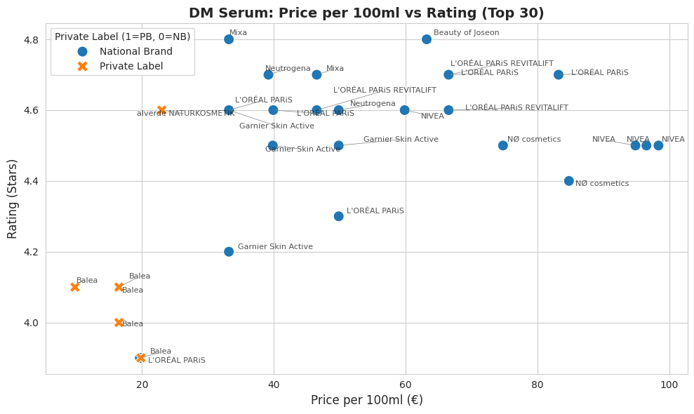
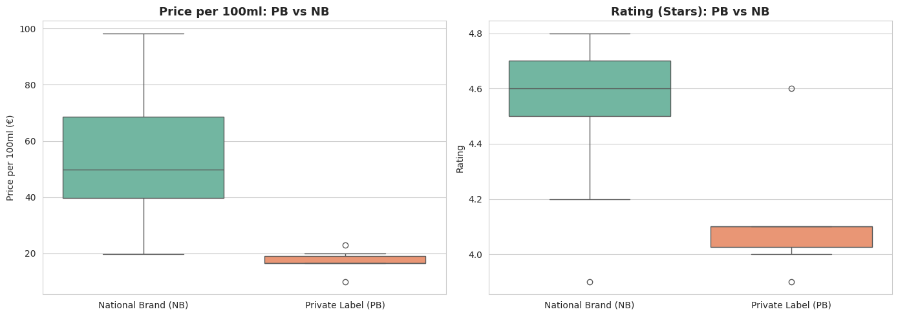

# 🧪 German Drugstore (dm) Facial Serum Analysis
> **Scraping, Cleaning, and Analyzing 197 Facial Serums from dm-drogerie markt: Price, Customer Ratings, and Active Ingredient Matrix**

[](https://www.python.org/)
[](https://opensource.org/licenses/MIT)

This repository contains an end-to-end data analysis project focusing on facial serums from Germany's leading drugstore chain, **dm (dm-drogerie markt)**. The workflow covers web scraping, missing value imputation, domain-specific text parsing (extracting skin concerns and active ingredients), and exploratory data analysis (EDA).

---

## 📌 Project Overview

* **Goal**: Evaluate market structure, price-to-performance ratio, and active ingredient trends across private label (PL) brands (e.g., *Balea*) and national brands (NB) (e.g., *L'Oréal Paris*, *NIVEA*, *Garnier*).
* **Dataset**: 197 facial serum products scraped from `dm.de` (focused analysis on top-reviewed SKUs).
* **Key Methodologies**:
  * **Web Scraping & Cleaning**: Data extraction, price standardization per 100ml (€), and character encoding handling (`utf-8-sig`).
  * **Feature Engineering**: Rule-based boolean flagging for skin concerns (`anti-aging`, `dark_spots`, `dry`, `sensitive`, etc.) and active ingredient normalization.
  * **Data Visualization**: Correlation analysis, scatter plots, and box plots comparing brand types and ingredient matrices.

---

## 📊 Key Findings

1. **Private Label (PL) vs. National Brand (NB) Polarizing**:
   * **Private Labels (*Balea*, *alverde*)**: Strongly compressed in the ultra-low price range (€10–€20 / 100ml), offering high affordability. However, customer ratings cluster moderately around an average median of **4.1 Stars**.
   * **National Brands (*L'Oréal*, *NIVEA*)**: Span a wider price spectrum (€50–€100+ / 100ml) with higher customer satisfaction, securing a **4.6 Stars** median rating.
2. **Top-Rated Segment Dominance**:
   * Out of products rated ★4.6 or higher, **Private Labels represent only 6.7%**, demonstrating strong consumer trust toward established National Brands for high-performance skincare.
3. **Core Skin Concern Drivers**:
   * **70% of the dataset** targets **Anti-Aging / Wrinkle Reduction**, making it the highest-priced and most saturated market segment, followed by **Dark Spots / Brightening** (Niacinamide, Vitamin C, Retinol).

---

## 📸 Visualizations

### 1. Price per 100ml (€) vs. Rating (Stars) Scatter Plot


### 2. Brand Category Distribution & Rating Comparison (Box Plot)


### 3. Active Ingredient & Concern Matrix (Sample)

| Brand | Product | Price / 100ml | Rating | Niacinamide | Vitamin C | Retinol | Hyaluron | Primary Concern |
| :--- | :--- | :---: | :---: | :---: | :---: | :---: | :---: | :--- |
| **L'Oréal Paris** | Age Perfect Le Duo | €83.17 | 4.7 | ✅ | ✅ | ❌ | ❌ | Anti-Aging / Dark Spots |
| **Balea** | Niacinamide Serum | €15.00 | 4.2 | ✅ | ❌ | ❌ | ❌ | Acne / Blemishes |
| **Garnier** | Vitamin C Serum | €35.00 | 4.5 | ✅ | ✅ | ❌ | ❌ | Dark Spots |

---

## 🛠 Tech Stack

* **Language**: Python 3.10+
* **Environment**: Google Colab / Jupyter Notebook
* **Libraries**:
  * **Data Wrangling**: `pandas`, `numpy`
  * **Visualization**: `matplotlib`, `seaborn`
  * **Text Processing & Parsing**: `re` (Regular Expressions), `BeautifulSoup4`

---

## 📁 Repository Structure

```text
dm-skincare-serum-analysis/
├── README.md                                # Project documentation (this file)
├── data/
│   ├── dm_serum_2026-08-07.csv              # Raw scraped data
│   ├── dm_serum_top30_working.csv           # Extract the top 30
│   └── skincare_dataset_dm_serum_top30.csv  # Cleaned and feature-engineered dataset
├── notebooks/
│   └── dm_serum_analysis.ipynb              # Main Jupyter Notebook (EDA & Plotting)
└── images/
    ├── dm_serum_scatter_plot.png            # Generated scatter plot
    └── dm_serum_boxplot.png                 # Generated box plot
